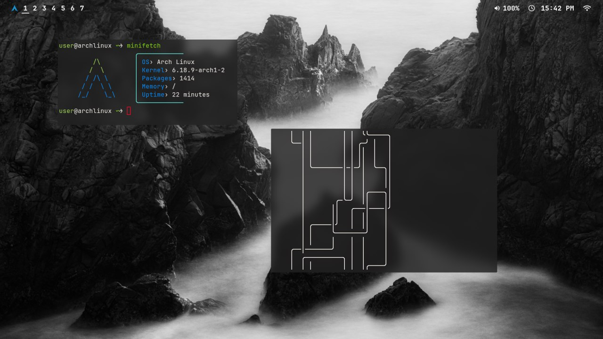
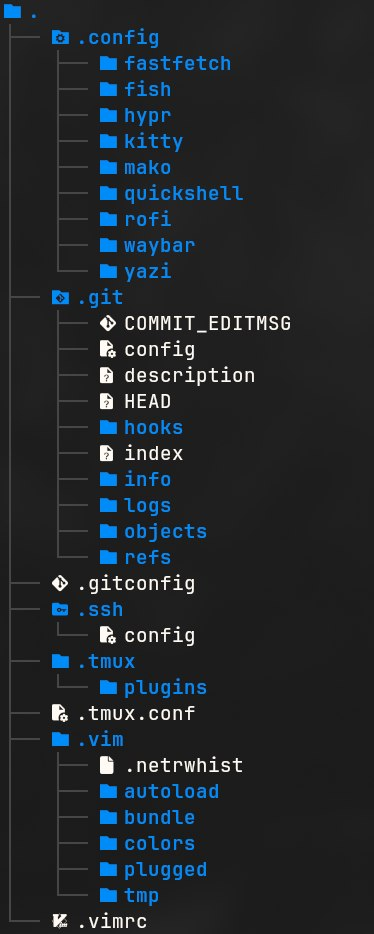
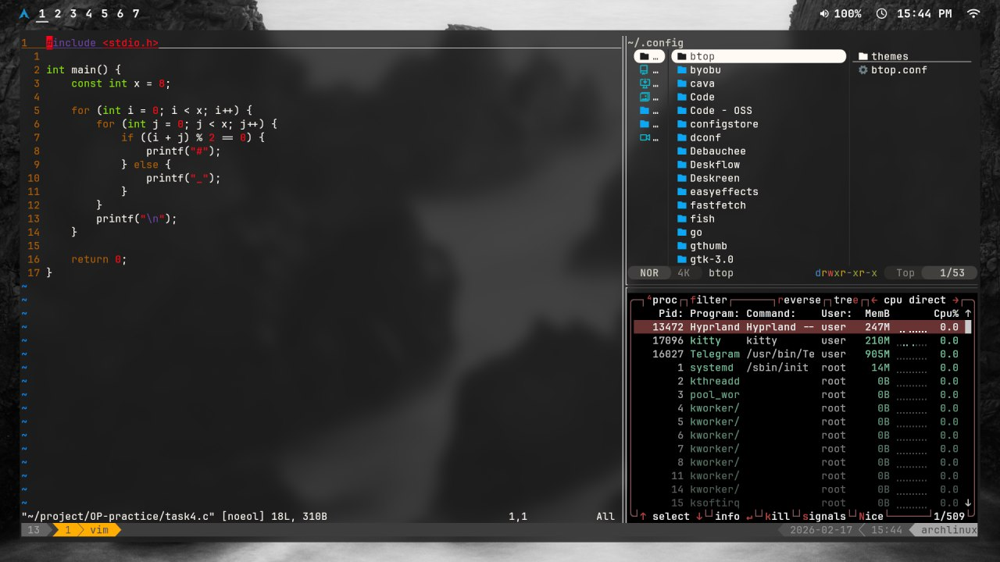

# 🌌 Dotfiles // Arch Linux & Hyprland

<p align="center">
  
</p>

Welcome to my dotfiles repository. This stores configuration files for my working environment based on **Arch Linux** and the **Hyprland** tiling window manager.

---


## 🛠 Technology Stack

* **OS:** Arch Linux
* **WM:** Hyprland (Wayland)
* **Terminal:** Kitty
* **Shell:** Fish
* **Editor:** Vim
* **Multiplexer:** Tmux
* **File Manager:** Yazi
* **Bar:** Waybar
* **Launcher:** Rofi (Wayland)
* **Notifications:** Mako

---

## 📂 Repository Structure

<details>
<summary><b>View Folder Structure</b></summary>
<br>
<p align="center">
  
</p>
</details>

The configs are organized in a way that allows them to be easily linked to the home directory using the `GNU Stow` utility.

### 🔹 `.config/` (User Settings)
* `fastfetch/` — System information fetch configuration.
* `fish/` — Shell settings, aliases, functions, and prompt.
* `hypr/` — Main window manager settings (keybindings, window rules, autostart).
* `kitty/` — Terminal configuration (fonts, colors, hotkeys).
* `mako/` — Appearance and rules for popup notifications.
* `quickshell/` — Settings for custom UI components on Wayland.
* `rofi/` — Themes and settings for the application launcher menu.
* `waybar/` — Custom status bar (modules, CSS styles).
* `yazi/` — Configuration for the fast terminal file manager.

### 🔹 Utilities in root (`~/`)
* `.gitconfig` — Global Git settings (name, email, aliases).
* `.ssh/config` — SSH connection and host settings. **(Note: private keys are added to `.gitignore` and are never committed to the public repository!)**
* `.tmux/` & `.tmux.conf` — Plugins and Tmux configuration for convenient work with terminal sessions.
* `.vim/` & `.vimrc` — My Vim configuration, including plugin manager, color schemes, and autoloading.

---

## 💻 Showcase / Workflow

<p align="center">
  
</p>

---

## 🚀 Installation

`GNU Stow` is used to automatically create symbolic links from this repository to your home directory.

### 1. Cloning the repository
Clone this repository into a hidden folder in your home directory:
```bash
git clone https://github.com/weaknessssss/.dotfiles.git
cd ~/.dotfiles
```
### 2. Using GNU Stow

Since the folder structure in the repository completely mirrors the structure of the home directory (for example, the .config folder is in the root of the repository), you just need to run one command from the `~/.dotfiles` folder:

```bash
stow .
```
Note: The `stow .` command will take all files and folders from the current directory (.config, .vim, .tmux, etc.) and create symlinks for them in the directory one level higher (that is, in `~/`). If you try to run `stow mako` inside the .config folder, the symlinks will mistakenly end up right in the root of `~/`.

### 3. Installing dependencies

Make sure you have the essential packages installed:

```bash
sudo pacman -S hyprland kitty fish tmux vim stow fastfetch rofi waybar mako yazi
```
#### 📝 Usage Notes
    Vim: Do not forget to run `:PlugInstall` (or your plugin manager's command) on your first Vim startup to fetch all dependencies into `~/.vim/plugged`.

    Tmux: To install plugins, press `Prefix + I` (by default `Ctrl+B`, then `Shift+I`) if you use TPM (Tmux Plugin Manager).

    Fish: To make fish the default shell, run: `chsh -s $(which fish)`.
