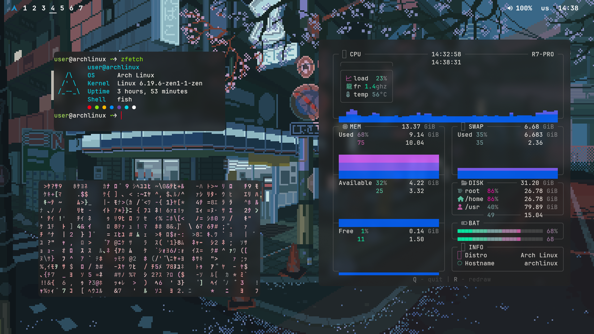
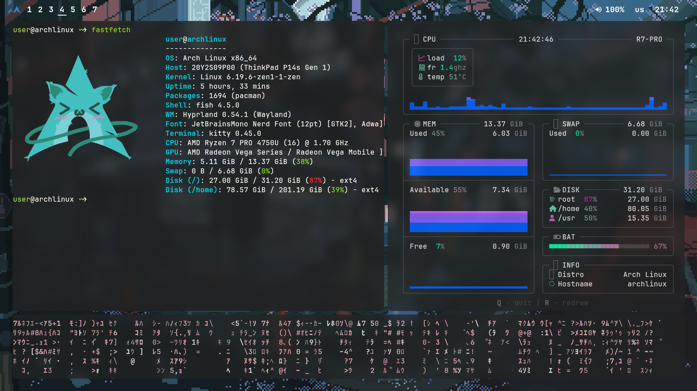

# 🌌 Dotfiles // Arch Linux & Hyprland

<p align="center">
  <a href="https://archlinux.org/"></a>
  <a href="https://hyprland.org/"></a>
</p>

<p align="center">
  
</p>

---

## 📝 Contents
- [Technology Stack](#-technology-stack)
- [Keyboard Shortcuts](#-keyboard-shortcuts)
- [Repository Structure](#-repository-structure)
- [Showcase / Workflow](#-showcase--workflow)
- [Installation](#-installation)

---

## ⌨️ Keyboard Shortcuts


| Keybinding | Action |
| :--- | :--- |
| `SUPER` + `Return` | Open Terminal (Kitty) |
| `SUPER` + `F` | Open Browser (Firefox) |
| `SUPER` + `D` | Open App Launcher (Rofi) |
| `SUPER` + `V` | Toggle floating window |
| `SUPER` + `C` | Close current window |
| `SUPER` + `M` | Exit Hyprland |
| `SUPER` + `[1-7]` | Switch to workspaces 1-7 |
| `SUPER` + `SHIFT` + `[1-7]` | Move active window to workspace 1-7 |
| `SUPER` + `Left/Right/Up/Down` | Move focus |

For terminal and shell aliases, please refer to the [Shell Shortcuts & Aliases guide](shell_shortcuts.md).

---

### 🔹 `config/` (User Settings)
* `fastfetch/` — System information fetch configuration.
* `fish/` — Shell settings, aliases, functions, and prompt.
* `hypr/` — Main window manager settings (keybindings, window rules, autostart).
* `kitty/` — Terminal configuration (fonts, colors, hotkeys).
* `mako/` — Appearance and rules for popup notifications.
* `quickshell/` — Settings for custom UI components on Wayland.
* `rofi/` — Themes and settings for the application launcher menu.
* `waybar/` — Custom status bar (modules, CSS styles).
* `yazi/` — Configuration for the fast terminal file manager.
* `.tmux/` & `.tmux.conf` — Plugins and Tmux configuration for convenient work with terminal sessions.
* `.vim/` & `.vimrc` — My Vim configuration, including plugin manager, color schemes, and autoloading.

---

## 💻 Showcase / Workflow

<p align="center">
  
</p>

---

## 🚀 Installation

An interactive Python script is provided to easily install the dotfiles and automatically backup any existing configuration.

### 1. Cloning the repository
Clone this repository into a hidden folder in your home directory:
```bash
git clone https://github.com/weaknessssss/.dotfiles.git
cd ~/.dotfiles
```
### 1.1 Manual setup
Make sure you install all dependencies before setup wallpaper

```bash
swww img /home/user/.dotfiles/assets/wp9637442-8-bit-japan-live-wallpapers.gif
```
### 2. Running the Installer

Run the interactive installation script and select what components you want to install:

```bash
chmod +x install.py
./install.py
```
*Note: The script will automatically backup any existing files before creating symlinks, so your current configuration is safe!*

### 3. Installing dependencies

Make sure you have the essential packages installed:

```bash
hyprland kitty fish tmux vim python fastfetch rofi waybar mako yazi swww
```
#### 📝 Usage Notes
    Vim: Do not forget to run `:PlugInstall` (or your plugin manager's command) on your first Vim startup to fetch all dependencies into `~/.vim/plugged`.

    Tmux: To install plugins, press `Prefix + I` (by default `Ctrl+B`, then `Shift+I`) if you use TPM (Tmux Plugin Manager).

    Fish: To make fish the default shell, run: `chsh -s $(which fish)`.
